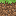

# 创新素质实践行——计算机游戏开发报告

## 前言

​	大家好，我是用Java写CSharp的萌新。本人是高一新生，C#编程技术强，对计算机图形学颇有理解，但任然不能完全理解我曾经在网课期间独自**三天内成功入门并熟练的C++**的全部。**不过这次我将挑战自我，使用C++开发一个“Minecraft”！**

​	根据《武汉市中小学“创新素质实践行”活动综合评价实施方案(试行)》（**根据洪山高级中学新生群内的文件，应该还需要《洪山高级中学2021年暑假社会综合实践指南》，但我在洪山高级中学官方网站、武汉市教育局官方网站甚至百度上并未找到此文件**）：

```
（三）文字作品类
　　　　1.评价内容：
　　　　（1）在研究性学习的过程中，撰写的关于学科学习和社会实践等的科学研究小论文。
　　　　（2）论文应附有参考书目。
　　　　（3）字数在800字以内。
```

故我以**学科学习**为主题做此报告。

成品的源代码在[Minecraft In Cpp](https://yts233.visualstudio.com/_git/Minecraft%20In%20Cpp)中。

## 了解Minecraft及OpenGL


​	Minecraft（我的世界）是一款沙盒式建造游戏，缔造者为Mojang Studios创始人马库斯·佩尔松，其灵感源于《无尽矿工》､《矮人要塞》和《地下城守护者》。现首席创意官为延斯·伯根斯坦，首席开发者为昂内丝·拉尔森。玩家可以在游戏中的三维空间里创造和破坏林林总总的方块，甚至在多人服务器与单人世界中体验不同的游戏模式，打造精妙绝伦的建筑物，创造物和艺术品。时至今日，Minecraft的游戏平台已囊括了移动设备和游戏主机。 （来自**[Minecraft官方百科](https://minecraft.fandom.com/zh/wiki/Minecraft_Wiki)**）

​	**OpenGL**（英语：*Open Graphics Library*，译名：**开放图形库**或者“开放式图形库”）是用于[渲染](https://zh.wikipedia.org/wiki/渲染)[2D](https://zh.wikipedia.org/wiki/二维计算机图形)、[3D](https://zh.wikipedia.org/wiki/三維計算機圖形)[矢量图形](https://zh.wikipedia.org/wiki/矢量圖形)的跨[语言](https://zh.wikipedia.org/wiki/程式語言)、[跨平台](https://zh.wikipedia.org/wiki/跨平台)的[应用程序编程接口](https://zh.wikipedia.org/wiki/应用程序编程接口)（API）。这个接口由近350个不同的函数调用组成，用来从简单的图形比特绘制复杂的三维景象。而另一种程序接口系统是仅用于[Microsoft Windows](https://zh.wikipedia.org/wiki/Microsoft_Windows)上的[Direct3D](https://zh.wikipedia.org/wiki/Direct3D)。OpenGL常用于[CAD](https://zh.wikipedia.org/wiki/CAD)、[虚拟现实](https://zh.wikipedia.org/wiki/虛擬實境)、科学可视化程序和[电子游戏开发](https://zh.wikipedia.org/wiki/电子游戏开发)。（来自**[维基百科，自由的百科全书](https://zh.wikipedia.org/wiki/OpenGL)**）

## 创建项目

​	我使用Visual Studio创建C++控制台项目，并简单安装配置glad、GLFW、glm、stb_image。

### 关于源文件的注意事项

​	**用中文前一定要设置编码UTF-8**，不然可能会这样：

​	不过把代码clone下来是正常的：


## Hello, Window!

创建一个`.cpp`文件并包含glfw、glad和iostream

```cpp
#include <glad/glad.h>
#include <GLFW/glfw3.h>
#include <iostream>
```

创建`main`函数

```cpp
int main()
{
    glfwInit(); //初始化glfw
    // 配置glfw
    glfwWindowHint(GLFW_CONTEXT_VERSION_MAJOR, 3);
    glfwWindowHint(GLFW_CONTEXT_VERSION_MINOR, 3);
    glfwWindowHint(GLFW_OPENGL_PROFILE, GLFW_OPENGL_CORE_PROFILE);
    
    // code here...
    
    return 0;
}
```

接下来可以创建一个窗口对象

```cpp
int w=800,h=600;
GLFWwindow* window = glfwCreateWindow(800, 600, "Hello World", NULL, NULL);
if (window == NULL)
{
    std::cout << "Failed to create GLFW window" << std::endl;
    glfwTerminate();
    return -1;
}
glfwMakeContextCurrent(window);
```

给glad传入OpenGL函数指针

```cpp
if (!gladLoadGLLoader((GLADloadproc)glfwGetProcAddress))
{
    std::cout << "Failed to initialize GLAD" << std::endl;
    return -1;
}
```

渲染循环

```cpp
while (!glfwWindowShouldClose(window)){
	// render loop
    glfwSwapBuffers(window);
    glfwPollEvents();
}
```

停止glfw

```
glfwTerminate();
```

按下Ctrl+B构建，按下F5运行，你将看到一个名为`Hello World`的窗体 (*[获取main.cpp](code/hellowindow.cpp)*)


## Hello, Triangle!

### 着色器

为了方便，直接用第三方着色器代码

下载[`shader.h`](https://yts233.visualstudio.com/_git/Minecraft%20In%20Cpp?path=%2FMICPP%2Finclude%2Fshader.h)并引用

```cpp
#include <shader.h>
```

#### 准备着色器

创建`shader.vs`作为顶点着色器

```glsl
#version 330 core
layout (location = 0) in vec3 aPos;

void main()
{
    gl_Position = vec4(aPos, 1.0F);
}
```

创建`shader.fs`作为片段着色器

```glsl
#version 330 core
out vec4 FragColor; //output color

void main()
{
    FragColor = vec4(0.5F, 0.6F, 0.9F, 1.0F);
} 
```

#### 加载着色器

大部分代码会由`shader.h`来执行

```cpp
Shader ourShader("shader.vs", "shader.fs");
```

### 顶点

三角形有三个顶点，直接打上去就行了

```cpp
float vertices[] = {
    -0.5F, -0.5F, 0.0F,
     0.5F, -0.5F, 0.0F,
     0.0F,  0.5F, 0.0F
};
```

绑定缓冲

```cpp
unsigned int VAO;
glGenVertexArrays(1, &VAO);
glBindVertexArray(VAO);
unsigned int VBO;
glGenBuffers(1, &VBO);
glBindBuffer(GL_ARRAY_BUFFER, VBO);
```

写入顶点数据

```cpp
glBufferData(GL_ARRAY_BUFFER, sizeof(vertices), vertices, GL_STATIC_DRAW);
```

链接顶点属性

```cpp
glVertexAttribPointer(0, 3, GL_FLOAT, GL_FALSE, 3 * sizeof(float), (void*)0);
glEnableVertexAttribArray(0);
```

### 设置Viewport

添加`framebufferSize`事件，以执行`glViewport`

```cpp
glfwSetFramebufferSizeCallback(window, framebuffer_size_callback);
```

```cpp
// 窗口大小改变回调
void framebuffer_size_callback(GLFWwindow* window, int width, int height)
{
	w = width;
	h = height;
	glViewport(0, 0, width, height);
}
```


### 渲染循环

```cpp
while (!glfwWindowShouldClose(window)){
	ourShader.use(); // 激活着色器
    glBindVertexArray(VAO); // 绑定顶点
    glDrawArrays(GL_TRIANGLES, 0, 3); // 渲染3个顶点
    glfwSwapBuffers(window);
    glfwPollEvents();
}
```

### 运行

按下Ctrl+B构建，按下F5运行，你将看到一个三角形 (*[获取main.cpp](code/hellotriangle.cpp)*)


### 彩色三角形

在顶点数据中添加颜色

```cpp
float vertices[] = {
    //position          color
    //X     Y     Z     R     G     B
    -0.5F, -0.5F, 0.0F, 1.0F, 0.0F, 0.0F,
     0.5F, -0.5F, 0.0F, 0.0F, 1.0F, 0.0F,
     0.0F,  0.5F, 0.0F, 0.0F, 0.0F, 1.0F
};
```

修改着色器

`shader.vs`

```glsl
#version 330 core
layout (location = 0) in vec3 aPos;
layout (location = 1) in vec3 aColor; //input color
out vec4 color; //output color with alpha
void main()
{
    gl_Position = vec4(aPos, 1.0F);
    color = vec4(aColor, 1.0F);
}
```

`shader.fs`

```glsl
#version 330 core
in vec4 color;
out vec4 FragColor; //output color

void main()
{
    FragColor = color;
} 
```

链接顶点属性

```cpp
glVertexAttribPointer(0, 3, GL_FLOAT, GL_FALSE, 6 * sizeof(float), (void*)0);
glEnableVertexAttribArray(0);
glVertexAttribPointer(1, 3, GL_FLOAT, GL_FALSE, 6 * sizeof(float), (void*)(3 * sizeof(float)));
glEnableVertexAttribArray(1);
```

按下Ctrl+B构建，F5运行一下


### 矩形

总所周知，**Minecraft没有三角形**，我们可以用两三角形组成一个矩形

```cpp
float vertices[] = {
    -0.5F, -0.5F, 0.0F,
     0.5F, -0.5F, 0.0F,
	-0.5F, 0.5F, 0.0F,
    -0.5F, 0.5F, 0.0F,
     0.5F, 0.5F, 0.0F,
	0.5F, -0.5F, 0.0F
};
```

```cpp
glDrawArrays(GL_TRIANGLES, 0, 6); // 渲染
```


## Hello, Huaji!

先准备一个小滑稽作为`huaji.png`


引用`stb_image.h`

```cpp
#include <stb_image.h>
```

创建并设置纹理

```cpp
unsigned int texture;
glGenTextures(1, &texture);
glBindTexture(GL_TEXTURE_2D, texture);
// set the texture wrapping parameters
glTexParameteri(GL_TEXTURE_2D, GL_TEXTURE_WRAP_S, GL_REPEAT);
glTexParameteri(GL_TEXTURE_2D, GL_TEXTURE_WRAP_T, GL_REPEAT);
// set texture filtering parameters
glTexParameteri(GL_TEXTURE_2D, GL_TEXTURE_MIN_FILTER, GL_LINEAR_MIPMAP_LINEAR);
glTexParameteri(GL_TEXTURE_2D, GL_TEXTURE_MAG_FILTER, GL_LINEAR);
```

加载纹理

```cpp
// load image, create texture and generate mipmaps
int width, height, nrChannels;
//stbi_set_flip_vertically_on_load(true); // tell stb_image.h to flip loaded texture's on the y-axis.
unsigned char *data = stbi_load("huaji.png", &width, &height, &nrChannels, 0);
if (data)
{
	glTexImage2D(GL_TEXTURE_2D, 0, GL_RGBA, width, height, 0, GL_RGBA, GL_UNSIGNED_BYTE, data);
	glGenerateMipmap(GL_TEXTURE_2D);
}
else
{
	std::cout << "Failed to load texture" << std::endl;
}
stbi_image_free(data);
```

修改着色器

`shader.vs`

```glsl
#version 330 core
layout (location = 0) in vec3 aPos;
layout (location = 1) in vec3 aTex; //texture coord
out vec2 texCoord;
out vec4 color;

void main()
{
    gl_Position = vec4(aPos, 1.0F);
    color = vec4(1.0F);
    texCoord = aTex;
}
```

`shader.fs`

```glsl
#version 330 core
in vec4 color;
in vec2 texCoord;
out vec4 FragColor; //output color
uniform sampler2D texture1; // texture sampler

void main()
{
    FragColor = texture(texture1, texCoord) * color;
} 
```

在顶点数据中添加纹理坐标

```cpp
float vertices[] = {
	//position          texCoord
	-0.5F, -0.5F, 0.0F, 0.0F, 0.0F,
	 0.5F, -0.5F, 0.0F, 1.0F, 0.0F,
	-0.5F,  0.5F, 0.0F, 0.0F, 1.0F,
	-0.5F,  0.5F, 0.0F, 0.0F, 1.0F,
	 0.5F,  0.5F, 0.0F, 1.0F, 1.0F,
	 0.5F, -0.5F, 0.0F, 1.0F, 0.0F
};
```

链接顶点属性

```cpp
glVertexAttribPointer(0, 3, GL_FLOAT, GL_FALSE, 5 * sizeof(float), (void*)0);
glEnableVertexAttribArray(0);
glVertexAttribPointer(1, 2, GL_FLOAT, GL_FALSE, 5 * sizeof(float), (void*)(3 * sizeof(float)));
glEnableVertexAttribArray(1);
```

渲染循环

```cpp
while (!glfwWindowShouldClose(window)) {
	ourShader.use(); // 激活着色器
	glBindTexture(GL_TEXTURE_2D, texture); // 绑定纹理
	glBindVertexArray(VAO); // 绑定顶点
	glDrawArrays(GL_TRIANGLES, 0, 6); // 渲染

	glfwSwapBuffers(window);
	glfwPollEvents();
}
```

运行一下


这个小滑稽上下颠倒，原因是像素的坐标是左上到右下，纹理的坐标是左下到右上，解决方案就是在着色器中直接把纹理纵坐标翻转一下

（*我知道`stb_image`可以直接翻转图像，但我已经把程序写好了，将计就计吧*）

```glsl
#version 330 core
layout (location = 0) in vec3 aPos;
layout (location = 1) in vec3 aTex;
out vec2 texCoord;
out vec4 color;

void main()
{
    gl_Position = vec4(aPos, 1.0F);
    color = vec4(1.0F);
    texCoord = vec2(aTex.x, 1.0F - aTex.y); // here
}
```

运行一下，可爱的小滑稽出来了


当然，也可以写一个函数来加载纹理

```cpp
// 加载纹理
void loadTexture(char filename[], unsigned int* texture, bool nearest) {
	glGenTextures(1, texture);
	glBindTexture(GL_TEXTURE_2D, *texture);
	// set the texture wrapping parameters
	glTexParameteri(GL_TEXTURE_2D, GL_TEXTURE_WRAP_S, GL_REPEAT);
	glTexParameteri(GL_TEXTURE_2D, GL_TEXTURE_WRAP_T, GL_REPEAT);
	// set texture filtering parameters
	if (nearest) {
		glTexParameteri(GL_TEXTURE_2D, GL_TEXTURE_MIN_FILTER, GL_NEAREST_MIPMAP_LINEAR);
		glTexParameteri(GL_TEXTURE_2D, GL_TEXTURE_MAG_FILTER, GL_NEAREST);
	}
	else {
		glTexParameteri(GL_TEXTURE_2D, GL_TEXTURE_MIN_FILTER, GL_LINEAR_MIPMAP_LINEAR);
		glTexParameteri(GL_TEXTURE_2D, GL_TEXTURE_MAG_FILTER, GL_LINEAR);
	}
	// load image, create texture and generate mipmaps
	int width, height, nrChannels;
	//stbi_set_flip_vertically_on_load(true); // tell stb_image.h to flip loaded texture's on the y-axis.
	unsigned char* data = stbi_load(filename, &width, &height, &nrChannels, 0);
	if (data)
	{
		glTexImage2D(GL_TEXTURE_2D, 0, GL_RGBA, width, height, 0, GL_RGBA, GL_UNSIGNED_BYTE, data);
		glGenerateMipmap(GL_TEXTURE_2D);
	}
	else
	{
		cout << "Failed to load texture" << endl;
	}
	stbi_image_free(data);
}
```

## Hello, 3D!

OpenGL中的3D系统比较复杂，涉及到部分线性代数知识。[LearnOpenGL](https://learnopengl.com/#!Getting-started/Transformations)上有详细的文章。

这个步骤会让OpenGL进入真正的3D世界

### 深度检测

为了防止后面的图形渲染在前面的图形后面，需要启动深度检测（**很多地方的翻译是深度测试，但我觉得叫深度检测更好**）

```cpp
glEnable(GL_DEPTH_TEST);
```

### 清除颜色和深度缓冲

先配置一下背景颜色

```cpp
glClearColor(0.3F, 0.4F, 0.7F, 1.0F);
```

在渲染循环最前面清楚缓冲

```cpp
while (!glfwWindowShouldClose(window)) {
	glClear(GL_COLOR_BUFFER_BIT | GL_DEPTH_BUFFER_BIT);
	//render code here...
}
```


### GLM

glm库定义了向量和矩阵等数据类型，并提供计算功能

```cpp
#include <glm/glm.hpp>
```

### 着色器

只修改顶点着色器就可以了

```glsl
#version 330 core
layout (location = 0) in vec3 aPos;
layout (location = 1) in vec3 aTex;
out vec2 texCoord;
out vec4 color;

uniform mat4 model;
uniform mat4 view;
uniform mat4 projection;

void main()
{
    gl_Position = projection * view * model * vec4(aPos, 1.0F); //矩阵变换
    color = vec4(1.0F);
    texCoord = vec2(aTex.x, 1.0F - aTex.y);
}
```

初始化所有矩阵

```cpp
ourShader.use(); // 激活着色器
ourShader.setMat4("model", glm::mat4(1.0F));
ourShader.setMat4("view", glm::mat4(1.0F));
ourShader.setMat4("projection", glm::mat4(1.0F));
```

### Hello Camera

#### 相机结构

直接抄代码

```cpp
struct Camera {
	glm::vec3 position; //相机位置
	glm::vec3 up = glm::vec3(0.0F, 1.0F, 0.0F);
	float yaw; //相机朝向
	float pitch;
	float fovy; //视场

	glm::vec3 direction;
	glm::vec3 front;
	glm::vec3 right;

    //计算向量
	void calculate() {
		if (pitch > 89.9F)pitch = 89.9F;
		else if (pitch < -89.9F)pitch = -89.9F;
		direction.x = std::cos(glm::radians(pitch)) * std::cos(glm::radians(yaw));
		direction.y = std::sin(glm::radians(pitch));
		direction.z = std::cos(glm::radians(pitch)) * std::sin(glm::radians(yaw));
		front.x = cos(glm::radians(yaw));
		front.y = 0;
		front.z = sin(glm::radians(yaw));
		right = glm::normalize(glm::cross(direction, up));
	}

    //计算视图矩阵
	glm::mat4 calculateViewMatrix() {
		glm::mat4 view(1.0F);
		view = glm::lookAt(position, position + direction, up);
		return view;
	}
    //计算投影矩阵
	glm::mat4 calculateProjectionMatrix() {
		glm::mat4 projection(1.0F);
		projection = glm::perspective(glm::radians(fovy), (float)w / ((float)h + 0.01f), 0.1f, 100.0f);
		return projection;
	}
};
```

#### 移动相机

创建相机

```cpp
Camera camera;
camera.fovy = 45.0F;
camera.position = glm::vec3(0.0F, 0.0F, -1.0F);
```

添加鼠标事件

```cpp
//glfw code here...
glfwSetInputMode(window, GLFW_CURSOR, GLFW_CURSOR_DISABLED);
glfwSetCursorPosCallback(window, mouse_callback);
//gl code here...
```

```cpp
float targetYaw, targetPitch, mouseSensitivity = 0.1F;
bool firstMouse = false;
float lastX, lastY;
void mouse_callback(GLFWwindow* window, double xpos, double ypos) {
	if (firstMouse) // 这个bool变量初始时是设定为true的
	{
		lastX = (float)xpos;
		lastY = (float)ypos;
		firstMouse = false;
		return;
	}
	float xoffset = (float)xpos - lastX;
	float yoffset = lastY - (float)ypos; // 注意这里是相反的，因为y坐标是从底部往顶部依次增大的
	lastX = (float)xpos;
	lastY = (float)ypos;

	targetYaw += xoffset * mouseSensitivity;
	targetPitch += yoffset * mouseSensitivity;
}
```

处理键盘输入

```cpp
float lastFrame = 0;
// 处理输入
void processInput(GLFWwindow* window)
{
	float currentFrame = (float)glfwGetTime();
	float deltaTime = currentFrame - lastFrame;
	lastFrame = currentFrame;
	float speed = 10.0F * deltaTime;
	if (glfwGetKey(window, GLFW_KEY_ESCAPE) == GLFW_PRESS)
		glfwSetWindowShouldClose(window, true);
	if (glfwGetKey(window, GLFW_KEY_W) == GLFW_PRESS)
		camera.position += camera.front * speed;
	if (glfwGetKey(window, GLFW_KEY_S) == GLFW_PRESS)
		camera.position -= camera.front * speed;
	if (glfwGetKey(window, GLFW_KEY_A) == GLFW_PRESS)
		camera.position -= camera.right * speed;
	if (glfwGetKey(window, GLFW_KEY_D) == GLFW_PRESS)
		camera.position += camera.right * speed;
	if (glfwGetKey(window, GLFW_KEY_SPACE) == GLFW_PRESS)
		camera.position += glm::vec3(0.0f, 1.0f, 0.0f) * speed;
	if (glfwGetKey(window, GLFW_KEY_LEFT_SHIFT) == GLFW_PRESS)
		camera.position -= glm::vec3(0.0f, 1.0f, 0.0f) * speed;
}
```

```cpp
while(...){//render loop
    processInput(window);
	//code after..
}
```

计算视角

```cpp
float deltaYaw = targetYaw - camera.yaw;
float deltaPitch = targetPitch - camera.pitch;
if (glm::abs(deltaYaw) < 0.01F)
	camera.yaw = targetYaw;
else camera.yaw += deltaYaw * 0.5F;
if (glm::abs(deltaPitch) < 0.01F)
	camera.pitch = targetPitch;
else camera.pitch += deltaPitch * 0.5F;
```

设置矩阵

```cpp
while (!glfwWindowShouldClose(window)) {
	//code before...
	ourShader.use(); // 激活着色器
	camera.calculate();
	ourShader.setMat4("view", camera.calculateViewMatrix());
	ourShader.setMat4("projection", camera.calculateProjectionMatrix());
	//render code here...
}
```

### 运行

运行一下，你会看到一个小滑稽。你可以移动鼠标或按`W`、`A`、`S`、`D`、`LShift`和`Space`来控制视角（**[获取main.cpp](code/hello3d.cpp)**）


是不是特别丝滑？如果你不喜欢这样，可以把`camera.yaw += deltaYaw * 0.5F;`和`camera.pitch += deltaPitch * 0.5F;`这里的常量`0.5F`改成更大的小数，但不要大于`1`.


## Hello Cube!

**Minecraft是由方块构成的世界，而不是矩形**。我将在这里渲染一个简单的"小滑稽块"

### 顶点数据

立方体由六个面组成，每个面有4个顶点。但是由于OpenGL不能渲染矩形，我们需要将每个面拆分成两个三角形，也就是6个顶点。所以一个方块需要36个顶点。

```cpp
const float vertices[180] = {
	//	  顶点坐标		纹理坐标		
	// front
	1.0f, 0.0f, 0.0f,	0.0f, 0.0f,	
	0.0f, 0.0f, 0.0f,	1.0f, 0.0f,	
	0.0f, 1.0f, 0.0f,	1.0f, 1.0f,	
	0.0f, 1.0f, 0.0f,	1.0f, 1.0f,	
	1.0f, 1.0f, 0.0f,	0.0f, 1.0f,	
	1.0f, 0.0f, 0.0f,	0.0f, 0.0f,	

	// back
	0.0f, 0.0f, 1.0f,	0.0f, 0.0f,	
	1.0f, 0.0f, 1.0f,	1.0f, 0.0f,	
	1.0f, 1.0f, 1.0f,	1.0f, 1.0f,	
	1.0f, 1.0f, 1.0f,	1.0f, 1.0f,	
	0.0f, 1.0f, 1.0f,	0.0f, 1.0f,	
	0.0f, 0.0f, 1.0f,	0.0f, 0.0f,	

	// left
	0.0f, 1.0f, 1.0f,	1.0f, 1.0f,	
	0.0f, 1.0f, 0.0f,	0.0f, 1.0f,	
	0.0f, 0.0f, 0.0f,	0.0f, 0.0f,	
	0.0f, 0.0f, 0.0f,	0.0f, 0.0f,	
	0.0f, 0.0f, 1.0f,	1.0f, 0.0f,	
	0.0f, 1.0f, 1.0f,	1.0f, 1.0f,	

	// right
	1.0f, 0.0f, 0.0f,	1.0f, 0.0f,	
	1.0f, 1.0f, 0.0f,	1.0f, 1.0f,	
	1.0f, 1.0f, 1.0f,	0.0f, 1.0f,	
	1.0f, 1.0f, 1.0f,	0.0f, 1.0f,	
	1.0f, 0.0f, 1.0f,	0.0f, 0.0f,	
	1.0f, 0.0f, 0.0f,	1.0f, 0.0f,	

	// bottom
	0.0f, 0.0f, 0.0f,	0.0f, 1.0f,	
	1.0f, 0.0f, 0.0f,	1.0f, 1.0f,	
	1.0f, 0.0f, 1.0f,	1.0f, 0.0f,	
	1.0f, 0.0f, 1.0f,	1.0f, 0.0f,	
	0.0f, 0.0f, 1.0f,	0.0f, 0.0f,	
	0.0f, 0.0f, 0.0f,	0.0f, 1.0f,	

	// top
	0.0f, 1.0f, 1.0f,	0.0f, 0.0f,	
	1.0f, 1.0f, 1.0f,	1.0f, 0.0f,	
	1.0f, 1.0f, 0.0f,	1.0f, 1.0f,	
	1.0f, 1.0f, 0.0f,	1.0f, 1.0f,	
	0.0f, 1.0f, 0.0f,	0.0f, 1.0f,	
	0.0f, 1.0f, 1.0f,	0.0f, 0.0f,	
};
```

### 面向对象

C++是一个面向对象的语言。为了方便之后的对象调用，创建一个`Cube`对象似乎更好

```cpp
unsigned int cubeVAO;
const float vertices[180] = { ... };
struct Cube {
	static void initalize() {
		glGenVertexArrays(1, &cubeVAO);
		glBindVertexArray(cubeVAO);
		unsigned int VBO;
		glGenBuffers(1, &VBO);
		glBindBuffer(GL_ARRAY_BUFFER, VBO);

		glBufferData(GL_ARRAY_BUFFER, sizeof(cubeVertices), cubeVertices, GL_STATIC_DRAW);

		glVertexAttribPointer(0, 3, GL_FLOAT, GL_FALSE, 5 * sizeof(float), (void*)0);
		glEnableVertexAttribArray(0);
		glVertexAttribPointer(1, 2, GL_FLOAT, GL_FALSE, 5 * sizeof(float), (void*)(3 * sizeof(float)));
		glEnableVertexAttribArray(1);
	}

	/// <summary>每个面的纹理</summary>
	int faces[6];

	/// <summary>渲染一个面</summary>
	/// <param name="face">方块的一个面,0:Front,1:Back,2:Left,3:Right,4:Bottom,5:Top</param>
	void render(int face) {
		glBindTexture(GL_TEXTURE_2D, faces[face]);
		glDrawArrays(GL_TRIANGLES, face * 6, 6);
	}

	/// <summary>渲染所有面</summary>
	void render() {
		for (int i = 0; i < 6; i++)
			render(i);
	}

	/// <summary>绑定</summary>
	void bind() {
		glBindVertexArray(cubeVAO);
	}

};
```

加载方块则可写为：

```cpp
Cube::initalize();

unsigned int texture;
loadTexture("huaji.png", &texture, false);

Cube huaji;
huaji.faces[0] = texture;
huaji.faces[1] = texture;
huaji.faces[2] = texture;
huaji.faces[3] = texture;
huaji.faces[4] = texture;
huaji.faces[5] = texture;
```

渲染循环：

```cpp
//set shader...
huaji.bind();
huaji.render();
```

### 运行

运行一下，你将看到一个小滑稽块，并且在小滑稽块内部也可以看到小滑稽（**[获取main.cpp](code/hellocube1.cpp)**）


### 面剔除

显然，我们不需要渲染方块内部。使用OpenGL的面剔除功能可以解决这个问题。

```cpp
glEnable(GL_CULL_FACE);
```


## Hello Chuck!

**Minecraft的世界是由区块组成**，区块内包含着**16\*256\*16个方块**。我们将创建一个`Chunk`类来进行区块渲染。

### class Chunk

花了点时间，`Chunk`的源代码写好了

```cpp
class Chunk {
private:
	Cube* _blocks[65536];
	Shader* _shader;
	int _x, _z;

public:
	Chunk(Shader* shader, int x, int z) {
		_shader = shader;
		_x = x;
		_z = z;
	}

	int getChunkX() {
		return _x;
	}

	int getChunkZ() {
		return _z;
	}
    
	Cube* getBlock(int x, int y, int z) {
		if (x < 0 || x>15 || y < 0 || y>255 | z < 0 || z>15)
			return NULL;
		int index = x | (z << 0x04) | (y << 0x08);
		return _blocks[index];
	}

	bool isBlock(int x, int y, int z) {
		if (x < 0 || x>15 || y < 0 || y>255 | z < 0 || z>15)
			return false;
		int index = x | (z << 0x04) | (y << 0x08);
		Cube* block = _blocks[index];
		return block != NULL;
	}

	void render() {
		glm::mat4 transform(1.0F);
		transform = glm::translate(transform, glm::vec3((float)(_x << 4), 0, (float)(_z << 4)));
		for (int y = 0; y < 256; y++) {
			for (int z = 0; z < 16; z++) {
				for (int x = 0; x < 16; x++) {
					Cube* block = getBlock(x, y, z);
					if (block == NULL)
						continue;
					_shader->setMat4("model", glm::translate(transform, glm::vec3((float)x, (float)y, (float)z)));
					block->bind();
					if (!isBlock(x, y, z - 1))
						block->render(0);
					if (!isBlock(x, y, z + 1))
						block->render(1);
					if (!isBlock(x - 1, y, z))
						block->render(2);
					if (!isBlock(x + 1, y, z))
						block->render(3);
					if (!isBlock(x, y - 1, z))
						block->render(4);
					if (!isBlock(x, y + 1, z))
						block->render(5);
				}
			}
		}
	}

	bool setBlock(int x, int y, int z, Cube* block) {
		if (x < 0 || x>15 || y < 0 || y>255 | z < 0 || z>15)
			return false;
		int index = x | (z << 0x04) | (y << 0x08);
		_blocks[index] = block;
		return true;
	}
};
```

### 写入方块

直接上代码

```cpp
// load huaji.png and block here..
Chunk chunk(&ourShader);
for (int z = 0; z < 16; z++)
	for (int x = 0; x < 16; x++)
		chunk.setBlock(x, 0, z, &huaji);
```


在render loop中删除原先渲染小滑稽的代码，添加以下代码

```cpp
chunk.render();
```

### 运行

运行一下，你将会看见分布在`y=0`位置的小滑稽 （**[获取main.cpp](code/hellochunk.cpp)**）


## Hello Light!

我们之前创建的小滑稽每一面都是**同一亮度**，而在Minecraft中，**方块的每个面之间都有亮度差距**。这里将使用**顶点着色器**实现太阳直线光。

`shader.vs`

```glsl
#version 330 core
layout (location = 0) in vec3 aPos;
layout (location = 1) in vec2 aTex;
layout (location = 2) in vec3 aNor;
out vec2 texCoord;
out vec4 color;

uniform mat4 model;
uniform mat4 view;
uniform mat4 projection;

void main()
{
    gl_Position = projection * view * model * vec4(aPos, 1.0F);
    texCoord = vec2(aTex.x, 1.0F - aTex.y);
    const float amb = 0.7F; //环境光
    const float dlig = 0.3F; //直线光权重
    const vec3 lightDir = normalize(vec3(1.0F,3.0F,2.0F)); //光路
    float diff = max(dot(aNor,lightDir),0.0F); //直线光大小
    float light = diff * dlig + amb; //亮度
    color = vec4(vec3(1.0F)*light,1.0F);
}
```

是不是很简单？再将法向量添加到顶点数组中并配置顶点属性就能看到光了！

```cpp
const float cubeVertices[288] = {
	//	  顶点坐标		纹理坐标			法线
	// front
	1.0f, 0.0f, 0.0f,	0.0f, 0.0f,		0.0f,  0.0f,  -1.0f,
	0.0f, 0.0f, 0.0f,	1.0f, 0.0f,		0.0f,  0.0f,  -1.0f,
	0.0f, 1.0f, 0.0f,	1.0f, 1.0f,		0.0f,  0.0f,  -1.0f,
	0.0f, 1.0f, 0.0f,	1.0f, 1.0f,		0.0f,  0.0f,  -1.0f,
	1.0f, 1.0f, 0.0f,	0.0f, 1.0f,		0.0f,  0.0f,  -1.0f,
	1.0f, 0.0f, 0.0f,	0.0f, 0.0f,		0.0f,  0.0f,  -1.0f,
										
	// back								
	0.0f, 0.0f, 1.0f,	0.0f, 0.0f,		0.0f,  0.0f,  1.0f,
	1.0f, 0.0f, 1.0f,	1.0f, 0.0f,		0.0f,  0.0f,  1.0f,
	1.0f, 1.0f, 1.0f,	1.0f, 1.0f,		0.0f,  0.0f,  1.0f,
	1.0f, 1.0f, 1.0f,	1.0f, 1.0f,		0.0f,  0.0f,  1.0f,
	0.0f, 1.0f, 1.0f,	0.0f, 1.0f,		0.0f,  0.0f,  1.0f,
	0.0f, 0.0f, 1.0f,	0.0f, 0.0f,		0.0f,  0.0f,  1.0f,
										
	// left								
	0.0f, 1.0f, 1.0f,	1.0f, 1.0f,		-1.0f,  0.0f,  0.0f,
	0.0f, 1.0f, 0.0f,	0.0f, 1.0f,		-1.0f,  0.0f,  0.0f,
	0.0f, 0.0f, 0.0f,	0.0f, 0.0f,		-1.0f,  0.0f,  0.0f,
	0.0f, 0.0f, 0.0f,	0.0f, 0.0f,		-1.0f,  0.0f,  0.0f,
	0.0f, 0.0f, 1.0f,	1.0f, 0.0f,		-1.0f,  0.0f,  0.0f,
	0.0f, 1.0f, 1.0f,	1.0f, 1.0f,		-1.0f,  0.0f,  0.0f,
										
	// right							
	1.0f, 0.0f, 0.0f,	1.0f, 0.0f,		1.0f,  0.0f,  0.0f,
	1.0f, 1.0f, 0.0f,	1.0f, 1.0f,		1.0f,  0.0f,  0.0f,
	1.0f, 1.0f, 1.0f,	0.0f, 1.0f,		1.0f,  0.0f,  0.0f,
	1.0f, 1.0f, 1.0f,	0.0f, 1.0f,		1.0f,  0.0f,  0.0f,
	1.0f, 0.0f, 1.0f,	0.0f, 0.0f,		1.0f,  0.0f,  0.0f,
	1.0f, 0.0f, 0.0f,	1.0f, 0.0f,		1.0f,  0.0f,  0.0f,
										
	// bottom							
	0.0f, 0.0f, 0.0f,	0.0f, 1.0f,		0.0f,  -1.0f,  0.0f,
	1.0f, 0.0f, 0.0f,	1.0f, 1.0f,		0.0f,  -1.0f,  0.0f,
	1.0f, 0.0f, 1.0f,	1.0f, 0.0f,		0.0f,  -1.0f,  0.0f,
	1.0f, 0.0f, 1.0f,	1.0f, 0.0f,		0.0f,  -1.0f,  0.0f,
	0.0f, 0.0f, 1.0f,	0.0f, 0.0f,		0.0f,  -1.0f,  0.0f,
	0.0f, 0.0f, 0.0f,	0.0f, 1.0f,		0.0f,  -1.0f,  0.0f,
										
	// top								
	0.0f, 1.0f, 1.0f,	0.0f, 0.0f,		0.0f,  1.0f,  0.0f,
	1.0f, 1.0f, 1.0f,	1.0f, 0.0f,		0.0f,  1.0f,  0.0f,
	1.0f, 1.0f, 0.0f,	1.0f, 1.0f,		0.0f,  1.0f,  0.0f,
	1.0f, 1.0f, 0.0f,	1.0f, 1.0f,		0.0f,  1.0f,  0.0f,
	0.0f, 1.0f, 0.0f,	0.0f, 1.0f,		0.0f,  1.0f,  0.0f,
	0.0f, 1.0f, 1.0f,	0.0f, 0.0f,		0.0f,  1.0f,  0.0f
};
```

```cpp
glVertexAttribPointer(0, 3, GL_FLOAT, GL_FALSE, 8 * sizeof(float), (void*)0);
glEnableVertexAttribArray(0);
glVertexAttribPointer(1, 2, GL_FLOAT, GL_FALSE, 8 * sizeof(float), (void*)(3 * sizeof(float)));
glEnableVertexAttribArray(1);
glVertexAttribPointer(2, 3, GL_FLOAT, GL_FALSE, 8 * sizeof(float), (void*)(5 * sizeof(float)));
glEnableVertexAttribArray(2);
```

设置完成后运行一下，你会看到方块每一面都有不同的亮度 （**[获取main.cpp](code/hellolight.cpp)**）


## Hello Grass Block!

你可能会觉得我一直使用小滑稽作为方块的贴图很草，在符合Minecraft和"节目效果"之间权衡后我决定把方块换成草

一个草方块由[`grass_top.png`](img/grass_top.png)、[`grass_side.png`](img/grass_side.png)和[`dirt.png`](img/dirt.png)组成

将这些方块添加到项目中，加载他们并设置`Cube`即可

```cpp
unsigned int textureHuaji, textureGrassTop, textureGrassSide, textureDirt;
loadTexture("huaji.png", &textureHuaji, true);
loadTexture("grass_top.png", &textureGrassTop, true);
loadTexture("grass_side.png", &textureGrassSide, true);
loadTexture("dirt.png", &textureDirt, true);

Cube huaji;
huaji.faces[0] = textureHuaji;
huaji.faces[1] = textureHuaji;
huaji.faces[2] = textureHuaji;
huaji.faces[3] = textureHuaji;
huaji.faces[4] = textureHuaji;
huaji.faces[5] = textureHuaji;

Cube grassBlock;
grassBlock.faces[0] = textureGrassSide;
grassBlock.faces[0] = textureGrassSide;
grassBlock.faces[0] = textureGrassSide;
grassBlock.faces[0] = textureGrassSide;
grassBlock.faces[0] = textureDirt;
grassBlock.faces[0] = textureGrassTop;

Cube dirt;
dirt.faces[0] = textureDirt;
dirt.faces[1] = textureDirt;
dirt.faces[2] = textureDirt;
dirt.faces[3] = textureDirt;
dirt.faces[4] = textureDirt;
dirt.faces[5] = textureDirt;

Chunk chunk(&ourShader, 0, 0);
for (int z = 0; z < 16; z++)
	for (int x = 0; x < 16; x++)
		chunk.setBlock(x, 0, z, &huaji);
for (int y = 1; y < 16; y++)
	for (int z = 0; z < 16; z++)
		for (int x = 0; x < 16; x++)
			chunk.setBlock(x, y, z, &dirt);
for (int z = 0; z < 16; z++)
	for (int x = 0; x < 16; x++)
		chunk.setBlock(x, 16, z, &grassBlock);
```

运行一下，是不是感觉很**草**？然而更草的是**最顶层的草不是草的颜色**！


一般情况下，我们需要给Cube每一面上颜色。**但由于时间和篇幅原因，我不得不打开我的`GIMP`将图片设置成绿色。**


再次运行，你就会看到不那么草的草方块 （**[获取main.cpp](code/hellograssblock.png)**）


## 半结尾

此报告在 2021/8/29 19:34 时开始编写，且`Minecraft In Cpp`在同一时间创建，代码和报告写到现在已经是 2021/8/30 18:21 了。我们学校31号开始上课，所以目前我**没有时间写下去了**。此文章使用的代码可以在[Minecraft In Cpp](https://yts233.visualstudio.com/_git/Minecraft%20In%20Cpp/Minecraft%20In%20Cpp)中找到，此文章可以在[Article](https://yts233.visualstudio.com/_git/Minecraft%20In%20Cpp/Article)中找到。假如你想看到后续文章，**请关注@用Java写CSharp的萌新，我可能会在不久之后有时间更新这篇文章！**

